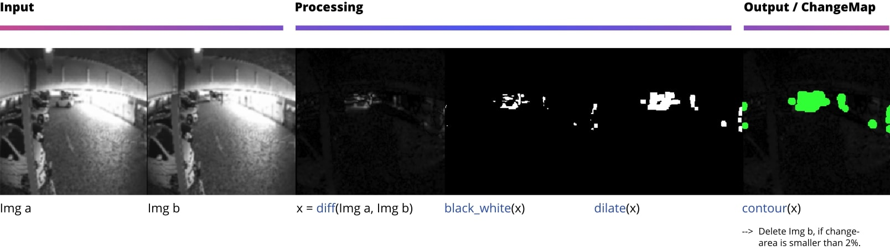

<h1 align="center">REMOVE DUPLICATES</h1>


<table  align='center'>
<tr>
<td>
  This repo removes duplicate (or similar) images in a folder using cv2.
</td>
</tr>
</table>

<p align="center"> 
  
</p>


---


<!-- TABLE OF CONTENTS -->
<h2 id="table-of-contents"> :book: Table of Contents</h2>
<p id="getting_started"></p>

<details open="open">
  <summary>Table of Contents</summary>
  <ol>
    <li><a href="#quick_start"> ➤ Quick start</a></li>
    <li><a href="#usage"> ➤ Usage</a></li>
    <li><a href="#config"> ➤ Config</a></li>
    <li><a href="#docker"> ➤ Docker</a></li>
    <li><a href="#troubleshooting"> ➤ Troubleshooting</a></li>
    <li><a href="#tests"> ➤ Tests</a></li>
    <li><a href="#roadmap"> ➤ Roadmap</a></li>
    <li><a href="#acknowledgements"> ➤ Acknowledgements</a></li>
  </ol>
</details> 


## Quick start
<p id="quick_start"></p>

Linux installation:

```sh
pip install -r requirements.txt # install requirements
```

Run:

```sh
python remove_duplicate_images.py --path-dataset PATH_DATASET
```


## Usage
<p id="usage"></p>

- The program can be run with the command line (see <a href="#quick_start"> Quick start</a>) or by instantiating the class RemoveDuplicateImages (see main() in remove_duplicate_images.py).

- Images can have the following formats: ".jpeg", ".jpg", ".png", ".gif" 

- Image names should start with the camera name, followed by "-" or "_": e.g.: c20_image1.jpg

- Only images, coming from the same camera are compared

## Config
<p id="config"></p>

- There are two places to find configs: (1) <strong>config.py</strong> (2) <strong>/configs</strong> folder.

- The sensitivity of the similarity filter can be adjusted with the arguments found under "Augmentation settings" and "Model settings" in <strong>config.py</strong> 

## Docker
<p id="docker"></p>


## Troubleshooting
<p id="troubleshooting"></p>


## Tests
<p id="tests"></p>

Run tests:

```sh
python test.py
```


## Roadmap
<p id="roadmap"></p>


## Acknowledgements
<p id="acknowledgements"></p>

